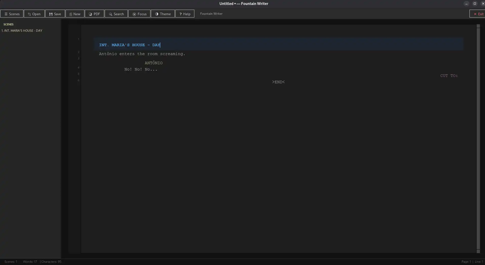
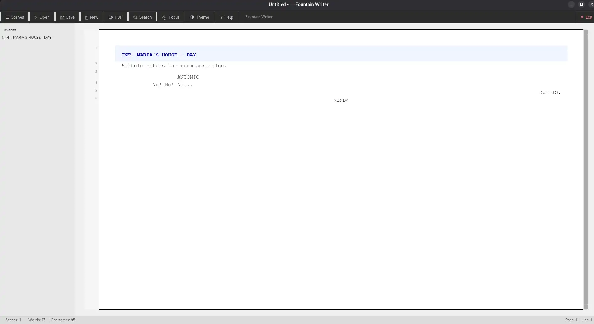

# Fountain Writer v2.0 (PySide6)

Editor de roteiros no formato **Fountain** — agora construído com **Qt6 (PySide6)**.

[](https://repo.rizomatico.org/ricograca/Fountain-Writer-Tool)

## ✨ Funcionalidades

- **Destaque de sintaxe Fountain** via `QSyntaxHighlighter` — cenas, personagens, diálogos, transições, rubricas
- **Navegador de cenas** em `QDockWidget` — clique para saltar para qualquer cena
- **Busca e substituição** (Ctrl+H) com navegação entre resultados
- **Autocomplete de personagens** — sugestão contextual ao digitar MAIÚSCULAS
- **Números de linha** com separador visual a cada 55 linhas (padrão cinematográfico)
- **Destaque da linha atual** — fundo sutil na linha em edição
- **Contador de palavras / caracteres / duração estimada** em tempo real
- **Modo foco** (F11) — toolbar e sidebar ocultos, papel centralizado
- **Exportação para PDF** (com reportlab)
- **Temas claro/escuro** via QSS
- **Configuração persistente** via QSettings

## Arquitetura

```
├── main.py                      ← Entry point
├── app/
│   ├── main_window.py           ← QMainWindow (toolbar, docks, status bar)
│   ├── editor/
│   │   ├── editor.py            ← QPlainTextEdit customizado
│   │   ├── highlighter.py       ← QSyntaxHighlighter (Fountain)
│   │   ├── line_numbers.py      ← Gutter com números de linha
│   │   └── autocomplete.py      ← QCompleter
│   ├── dockers/
│   │   └── scene_navigator.py   ← QDockWidget (navegador de cenas)
│   ├── dialogs/
│   │   ├── find_replace.py      ← Busca e substituição
│   │   └── help_dialog.py       ← Janela de ajuda
│   ├── models/
│   │   └── fountain.py          ← Parser Fountain + funções utilitárias
│   └── core/
│       ├── config.py            ← QSettings
│       └── theme.py             ← QSS + cores
├── resources/
│   └── styles/
└── archive/                     ← Versão anterior (Tkinter)
```

## 🖥️ Plataformas

- Windows, macOS, Linux

## 🔧 Requisitos

```bash
pip install PySide6
pip install reportlab   # opcional, para PDF
```

## 🚀 Executar

```bash
python3 main.py
```

## ⌨️ Atalhos

| Atalho | Ação |
|--------|------|
| `Ctrl+S` | Salvar |
| `Ctrl+O` | Abrir |
| `Ctrl+N` | Novo |
| `Ctrl+H/F` | Buscar e substituir |
| `F11` | Modo foco |
| `Esc` | Sair do modo foco |
| `Ctrl+↑/↓` | Rolar 55 linhas |

---

### Imagens



