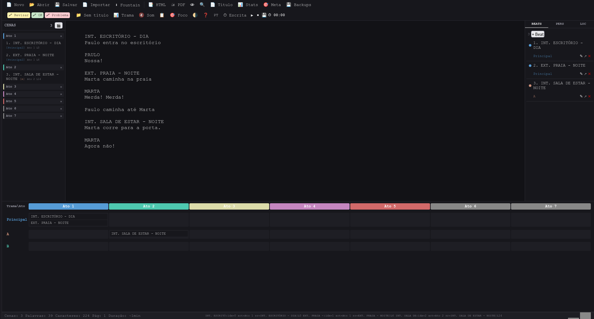
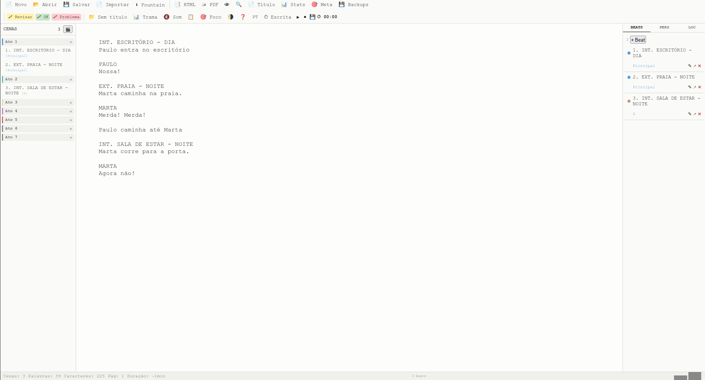

# Fountain Writer — Editor de Roteiros Fountain

**Editor Fountain em HTML/CSS/JS puro. Zero dependências. Funciona em qualquer navegador.**

Autor: **Ricardo A. B. Graça** — [ricolandia.com](https://www.ricolandia.com)

---

## Funcionalidades

| Funcionalidade | Descrição |
|---|---|
| **Editor** | Textarea com auto-save a cada 10s (localStorage) |
| **Preview** | Live rendering Fountain (CHARACTER 37%, DIALOGUE 20%) |
| **Sidebar de cenas** | Lista com separadores visuais de ato (Ato 1–7 fixos, ✕ para remover) |
| **Atribuição por beat** | Muda o ato da cena pelo modal do beat — sidebar atualiza |
| **Beats** | CRUD com plotline (Principal/A/B), inserção no texto (↗), drag reorder |
| **Timeline** | Grid atos × tramas, mostra cenas em cada célula |
| **Personagens** | Extraídos automaticamente, com editor de perfil |
| **Locais** | Extraídos automaticamente do texto |
| **Find/Replace** | Case-sensitive, replace all |
| **Folha de rosto** | Formulário salvo em localStorage |
| **Side-by-side** | Editor / Preview / Split (👁) |
| **Temas** | Claro/escuro (detecção automática + manual) |
| **Idiomas** | Português / English (recarrega) |
| **Export HTML** | Download .html formatado |
| **Export PDF** | Via impressão do navegador |
| **⬇ Fountain** | Download .fountain (texto puro) |
| **📄 Importar** | Importa .fountain (texto puro) |
| **📂 Abrir** | Abre projeto .fountain.json |
| **💾 Salvar** | Salva projeto completo .json |
| **Pomodoro** | Timer de escrita + Pomodoro 25min |
| **Metas diárias** | Meta de palavras com progresso |
| **Highlights** | Marcação colorida por linha (Ctrl+1/2/3) |
| **Auto-backup** | A cada 5min, 10 versões, com restore |
| **Estatísticas** | Cenas, palavras, top personagens |
| **Gráfico** | Produtividade dos últimos 7 dias |
| **Som** | Efeito sonoro de teclas (toggle) |
| **Zoom** | Ctrl+=/-/0 para ajustar fonte |
| **Foco** | F11: esconde painéis, só o editor |
| **Atalhos** | Ctrl+B/I/U (bold/italic/underline) |

## 💾 Sobre Salvar

O Fountain Writer usa dois sistemas de persistência:

| Método | O que salva | Quando |
|---|---|---|
| **localStorage** | Texto + beats + atos | Auto-save a cada 10s |
| **Backup** | Texto + beats + atos | A cada 5min (10 versões) |
| **💾 Salvar** | Projeto completo .json | Manual |

**💾 Salvar no Chrome/Edge/Opera:**
- 1ª vez: abre diálogo "Salvar como" (escolha a pasta)
- 2ª vez em diante: salva **no mesmo arquivo**, sem perguntar

**💾 Salvar no Firefox/Safari:**
- Sempre baixa o .fountain.json para a pasta de Downloads

**Proteção contra perda de dados:**
- Antes de fechar/recarregar, se houver alterações, o navegador pergunta "Tem certeza?"
- Lembrete "💾 Salve seu projeto" na barra de status até o primeiro save
- Backups restauráveis via botão 💾 Backups

## Como usar

Abra `web/index.html` em qualquer navegador moderno.

### Deploy estático

Copie a pasta `deploy/` para o servidor FTP.

### Docker (API opcional para PDF/HTML)

```bash
cd web
docker compose up -d
# http://localhost:8000
```

## Tecnologias

HTML5, CSS3, JavaScript (ES6+), localStorage, File System Access API.

## Imagens


*Editor com sidebar de cenas e timeline*


*Preview ao vivo com formatação Fountain*
