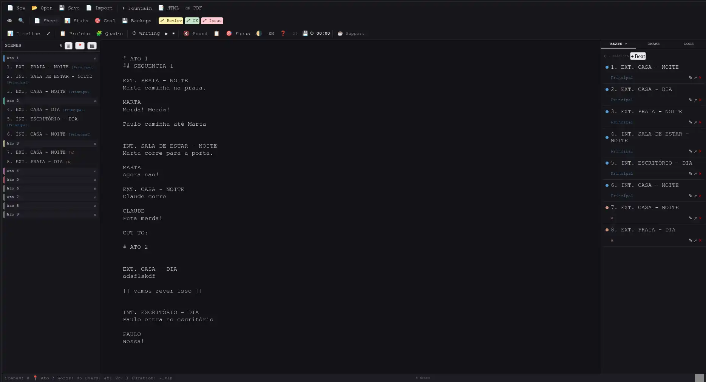
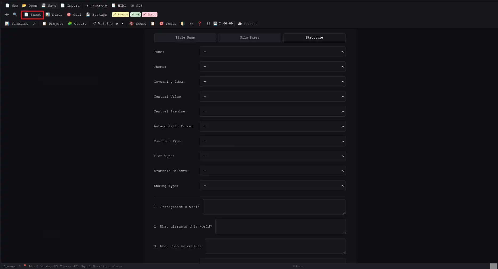
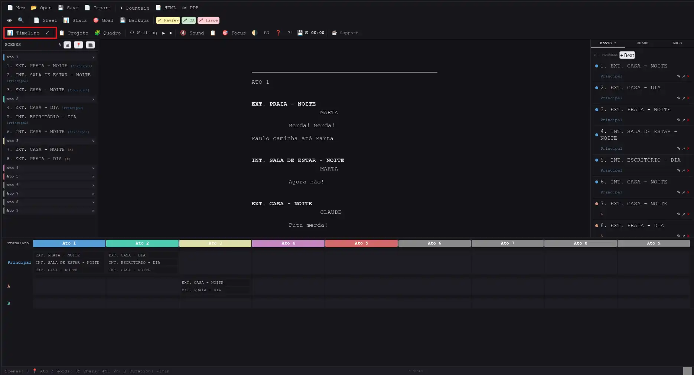
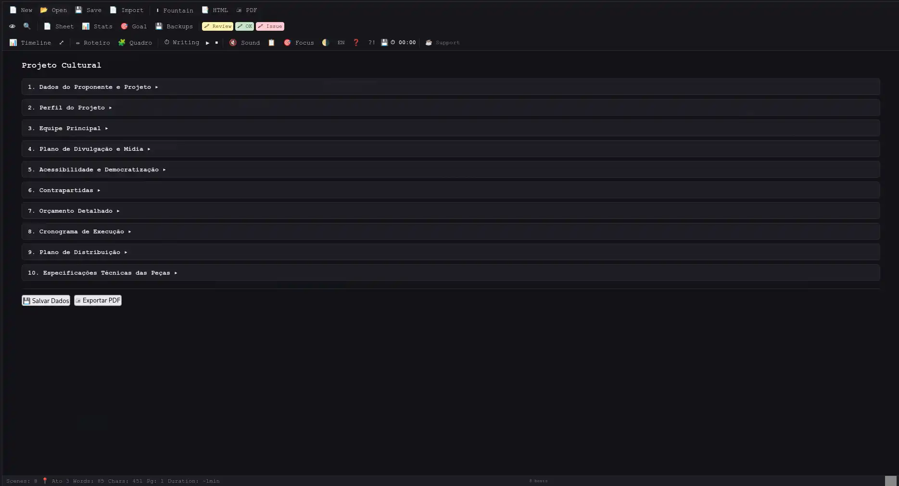
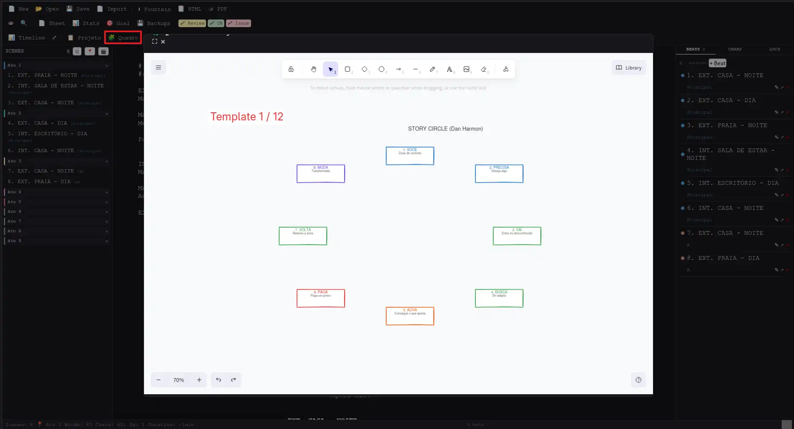

# Fonte — Editor de Roteiros Fountain


**🇧🇷 Português · 🇺🇸 English** — O app tem suporte a ambos os idiomas. A documentação abaixo está em português. [English version →](#english)

**Editor Fountain em HTML/CSS/JS puro. Zero dependências. Funciona em qualquer navegador.**

Disponível em 3 formatos: **📦 Web** (zip universal — baixe, extraia, abra index.html), **🖥 Server** (rede local) e **📱 PWA** (instalável, offline).

Autor: **Ricardo A. B. Graça** — [ricolandia.com](https://www.ricolandia.com)

---

## Funcionalidades

| Funcionalidade | Descrição |
|---|---|
| **Editor** | Textarea com auto-save a cada 10s (localStorage) |
| **Preview** | Live rendering Fountain (CHARACTER 37%, DIALOGUE 20%) |
| **Corkboard** | Visualização em cards (toggle ⊞/⊟) |
| **Sidebar de cenas** | Lista com separadores visuais de ato (Ato 1–7 fixos) |
| **Atribuição por beat** | Muda o ato da cena pelo modal do beat |
| **Beats** | CRUD com plotline (Principal/A/B), inserção no texto (↗), drag reorder |
| **Comentários** | Comentários por beat (autor + timestamp) |
| **Timeline** | Grid atos × tramas, com expandir tela cheia (⤢) |
| **Personagens** | Extraídos automaticamente, com editor de perfil |
| **Locais** | Extraídos automaticamente do texto |
| **Find/Replace** | Case-sensitive, replace all |
| **Folha de rosto** | Título, crédito, autor, fonte, data, contato |
| **Ficha do Filme** | Logline, sinopse, argumento, gênero, duração, público-alvo |
| **Estrutura da História** | McKee: ideia governante, valor central, premissa, força antagônica, dilema, tipo de trama, perguntas guiadas |
| **Imprimir ficha** | Gera PDF da ficha do filme + estrutura |
| **PWA** | Instalável como app, service worker com cache offline |
| **Side-by-side** | Editor / Preview / Split (👁) |
| **Temas** | Claro (creme/papel) / escuro |
| **Idiomas** | Português / English (recarrega) |
| **Export HTML** | Download .html formatado |
| **Export PDF** | Via impressão do navegador (com page-breaks) |
| **⬇ Fountain** | Download .fountain (texto puro) |
| **📄 Importar** | Importa .fountain (texto puro) |
| **📂 Abrir** | Abre projeto .fountain.json |
| **💾 Salvar** | Salva projeto completo .json |
| **Pomodoro** | Timer de escrita + Pomodoro 25min |
| **Metas diárias** | Meta de palavras com progresso |
| **Highlights** | Marcação colorida por linha (Ctrl+1/2/3) |
| **Auto-backup** | A cada 5min, 10 versões, com restore |
| **Estatísticas** | Cenas, palavras, top personagens |
| **Gráfico** | Produtividade dos últimos 7 dias |
| **Som** | Efeito sonoro de teclas (toggle) |
| **Zoom** | Ctrl+=/-/0 para ajustar fonte |
| **Foco** | F11: esconde painéis, só o editor |
| **Atalhos** | Ctrl+B/I/U (bold/italic/underline) |
| **Marcador 📍** | Insere `# Ato N` no texto com um clique |
| **Indicador de ato** | Mostra o ato atual na barra de status |

## 🧩 Quadro de Planejamento Visual (Excalidraw)

Editor visual completo para planejar seu roteiro. Funciona offline, 100% local.

**12 templates prontos:**

| Template | Descrição |
|----------|-----------|
| **3 Atos** | Colunas para cada ato com cartões de cena |
| **Jornada do Herói** | 12 estágios clássicos |
| **Mapa de Personagens** | Relações entre personagens |
| **Save the Cat** | 15 beats numerados por página |
| **Story Circle (Harmon)** | 8 passos em círculo |
| **Quadro de Cenas** | Corkboard estilo index cards |
| **Estrutura de TV** | Teaser + Atos + Tag |
| **Batman Chart** | Grid atos × tramas |
| **Mood Board** | Paleta de cores, referências, inspiração |
| **Diagrama de Relações** | Mapa de conexões entre personagens com setas |
| **Linha do Tempo** | Cenas posicionadas no eixo temporal com trilhas de subtrama |
| **Arco de Personagem** | Curva emocional com pontos narrativos chave |

Para usar: abra o 🧩 Quadro → no Excalidraw, use **Open** → escolha um template `.excalidraw`.

## 💾 Sobre Salvar

O Fonte usa dois sistemas de persistência:

| Método | O que salva | Quando |
|---|---|---|
| **localStorage** | Texto + beats + atos | Auto-save a cada 10s |
| **Backup** | Texto + beats + atos + cores + marcações | A cada 5min (10 versões) |
| **💾 Salvar** | Projeto completo .json | Manual |

**💾 Salvar no Chrome/Edge/Opera:**
- 1ª vez: abre diálogo "Salvar como" (escolha a pasta)
- 2ª vez em diante: salva **no mesmo arquivo**, sem perguntar

**💾 Salvar no Firefox/Safari:**
- Sempre baixa o .fountain.json para a pasta de Downloads

**Proteção contra perda de dados:**
- Antes de fechar/recarregar, se houver alterações, o navegador pergunta "Tem certeza?"
- Lembrete "💾 Salve seu projeto" na barra de status até o primeiro save
- Backups restauráveis via botão 💾 Backups

### ☕ Apoie o projeto

**🇧🇷 Pix:** `ricardograca@ricolandia.com`  
**💳 PayPal:** [Donate](https://www.paypal.com/cgi-bin/webscr?cmd=_donations&business=ricolandia%40gmail.com&currency_code=BRL)  
**🧡 GitHub Sponsors:** [github.com/sponsors/ricolandia](https://github.com/sponsors/ricolandia)

---

## Como usar

### 📦 Opção 1 — Zip universal (recomendado)

Baixe o `Fonte-web.zip` na [página de Releases](https://github.com/ricolandia/Fountain-Writer-Tool/releases), extraia e abra `index.html`.

### 📲 Instalar no celular

**📦 Pelo zip (qualquer dispositivo):**
Após extrair o zip e abrir `index.html` no navegador:
- **Android (Chrome):** ⋮ → **Instalar Fonte**
- **iPhone/iPad (Safari):** Compartilhar → **Adicionar à tela de início**

O app funciona offline como se fosse nativo.

**📱 Pelo demo online:**
Acesse [https://www.ricolandia.com/editor-roteiros-gratuito/Demo/index.html](https://www.ricolandia.com/editor-roteiros-gratuito/Demo/index.html)
pelo navegador do celular e siga o mesmo passo. Não precisa baixar nada.

### 🖥 Opção 2 — Servidor local

```bash
python3 serve.py
# Abrir http://localhost:8000/web/index.html
```

Ou abrir `web/index.html` direto no navegador (alguns recursos podem precisar de servidor HTTP).

### ☁️ Opção 3 — Deploy estático

Copie a pasta `deploy/` para qualquer servidor HTTP estático (FTP, Nginx, Apache).

### Opção 3 — Docker (API opcional para PDF/HTML)

```bash
cd web
docker compose up -d
# http://localhost:8000
```

## Sincronização via nuvem (Dropbox, OneDrive, Google Drive)

1. Coloque a pasta `Fonte/` dentro da sua pasta de nuvem
2. Crie uma subpasta (ex: `roteiros/`)
3. Ao salvar (💾), escolha essa pasta como destino
4. O navegador lembra e salva sempre no mesmo lugar
5. Seus roteiros sincronizam em todos os dispositivos

## Tecnologias

HTML5, CSS3, JavaScript (ES6+), Excalidraw (UMD bundle offline), localStorage, File System Access API, Service Worker (PWA).

---

<span id="english"></span>

## 🇺🇸 English — Fonte Screenplay Editor

**Pure HTML/CSS/JS. Zero dependencies. Works in any browser.**

Available in 4 formats: **Web** (open directly), **Server** (local network), **PWA** (installable, offline) and **Desktop** (native executable).

Author: **Ricardo A. B. Graça** — [ricolandia.com](https://www.ricolandia.com)

### Quick start

```bash
python3 serve.py
# Open http://localhost:8000/web/index.html
```

Or open `web/index.html` directly (some features need HTTP server).

### 📲 Install on mobile

**📦 From the zip (any device):**
After extracting and opening `index.html` in the browser:
- **Android (Chrome):** ⋮ → **Install Fonte**
- **iPhone/iPad (Safari):** Share → **Add to Home Screen**

Works offline like a native app.

**📱 From the online demo:**
Visit [https://www.ricolandia.com/editor-roteiros-gratuito/Demo/index.html](https://www.ricolandia.com/editor-roteiros-gratuito/Demo/index.html)
on your phone browser and follow the same steps. No download needed.

### Downloads
- **📦 Web:** [Download Fonte-web.zip](https://github.com/ricolandia/Fountain-Writer-Tool/releases) — extract and open `index.html`
- **📱 PWA:** Chrome/Edge → ⋮ → Install
- **Source:** `git clone https://github.com/ricolandia/Fountain-Writer-Tool`

### Features

- Fountain screenplay editor with live preview
- Scene navigator, beats, timeline, characters, locations
- **Film Sheet:** logline, synopsis, treatment, genre
- **Story Structure:** McKee's governing idea, central value, antagonistic force, guided questions
- **Excalidraw Planning Board** with 12 templates
- **Cultural Project** module (10 sections for Brazilian incentive laws)
- PWA: installable, works offline
- i18n: PT-BR / English
- Dark/light themes, daily goals, pomodoro timer, auto-backup

### License

MIT — free to use, modify, and distribute.

### ☕ Support

**🇧🇷 Pix:** `ricardograca@ricolandia.com`  
**💳 PayPal:** [Donate](https://www.paypal.com/cgi-bin/webscr?cmd=_donations&business=ricolandia%40gmail.com&currency_code=BRL)  
**🧡 GitHub Sponsors:** [github.com/sponsors/ricolandia](https://github.com/sponsors/ricolandia)

---

## Imagens


*Editor principal com preview ao vivo e timeline*


*Estrutura da História — McKee: ideia governante, valor central, força antagônica*


*Timeline — atos × tramas com subtramas*


*Projeto Cultural — 10 seções para leis de incentivo*


*Quadro de Planejamento Visual — Excalidraw com 12 templates*
