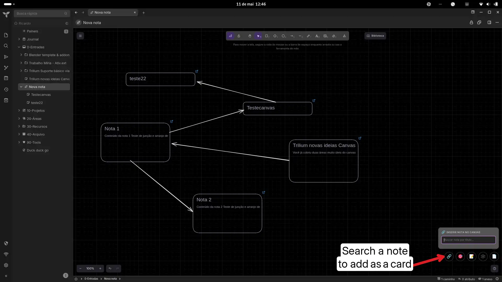
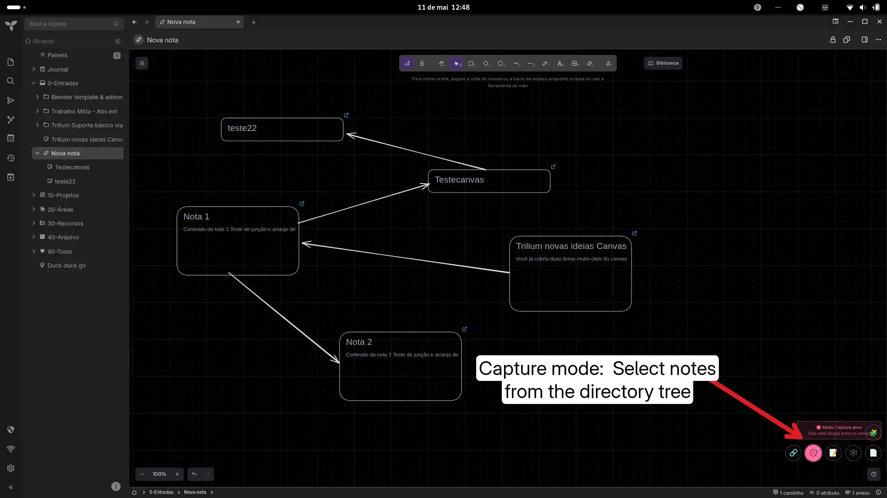
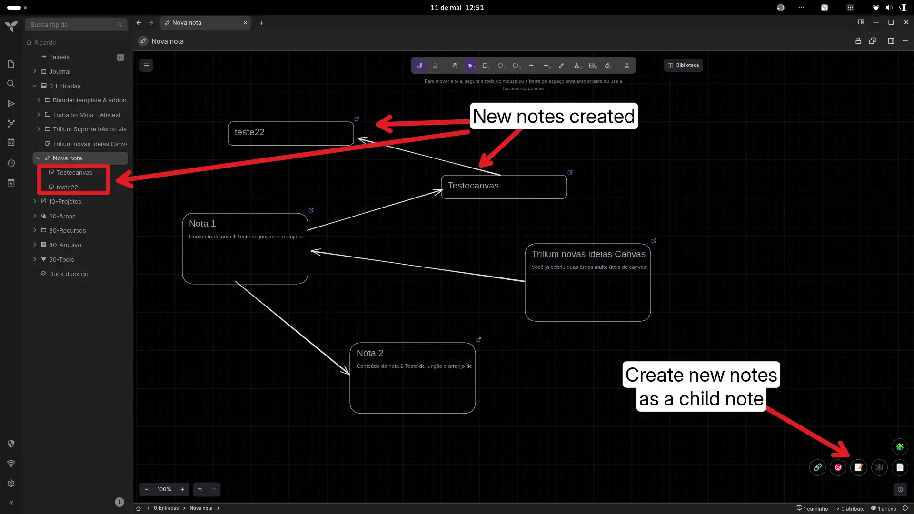
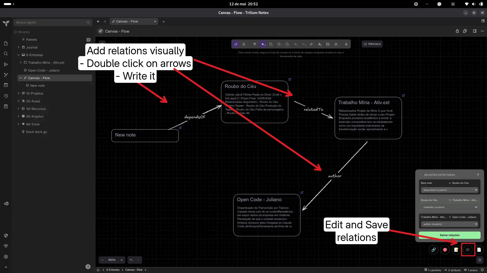
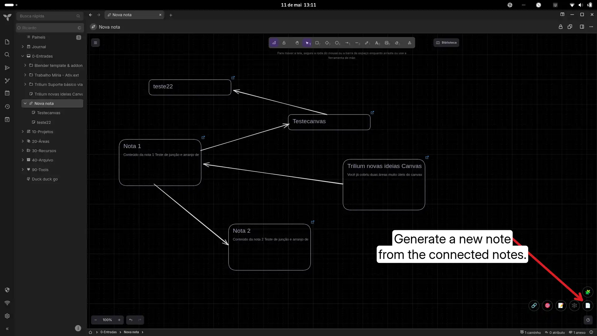

# Canvas Note Tools

A custom Canvas workflow for TriliumNext focused on visual thinking, writing flow, and longform organization. It acts as a bridge between visual thinking, non-linear outlining, and knowledge management.

## Features

* **🔍 Quick Search:** Find and insert notes directly onto your canvas using a floating search window.
* **🎯 Capture Mode:** Toggle to navigate your tree — every note clicked is inserted as a card. Persists across reloads via `sessionStorage`.
* **📝 Create on the Fly:** Draft and add new child notes without leaving the canvas.
* **🕸️ Smart Relations:** Detects arrow connections between cards. Auto-detects relation types from text written on arrows (`inspira`, `contradiz`, etc.) and updates labels on save.
* **🗑️ Remove Cards:** List all linked cards and remove individual ones directly from the canvas.
* **📄 Longform Synthesis:** Generate comprehensive documents by combining canvas cards in arrow-based order (topological sort).
* **⌨️ Keyboard:** Press `Escape` to dismiss any open panel. Click outside panels to close them.
* **⚡ Local & Fast:** Lightweight, fully local, clean floating UI with glass-morphism design.

## Installation

1. Create a new note of type `JS Frontend`.
2. Add the label: `#widget`.
3. Paste the full code or import the `.zip` release.
4. Reload TriliumNext (`F5`).

## Usage
Open any Canvas note. Use the floating toolbar:

| Button | Action |
|---|---|
| 🔗 | Search and insert notes into the canvas |
| 🎯 | Toggle capture mode (click notes in the tree) |
| 📝 | Create a new child note and insert as card |
| 🕸️ | Detect and edit relations from arrow connections |
| 🗑️ | List and remove cards from the canvas |
| 📄 | Generate longform document from card order |

## Original link
[https://github.com/orgs/TriliumNext/discussions/9668](https://github.com/orgs/TriliumNext/discussions/9668)

### Images  

