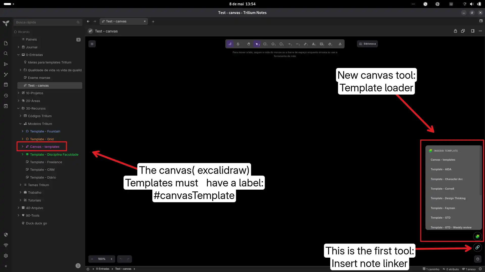

# Canvas Template Loader Widget

A lightweight template system for Trilium Canvas. Insert complete visual frameworks directly into your Excalidraw canvases with a single click.

## Features

* **🧩 1-Click Insertion:** Easily add reusable Excalidraw templates into any active canvas.
* **Native Integration:** Templates are just standard Excalidraw canvas notes, making them easy to edit, duplicate, and expand.

## Installation

1. Create a new note of type `JS Frontend`.
2. Add the label: `#widget`.
3. Paste the widget code or import the `.zip`.
4. Reload TriliumNext (`F5`).

## Creating Templates

To make a canvas available as a template:
1. Create a normal Canvas note.
2. Give it a title (e.g., "GTD", "SWOT").
3. Add the label: `#canvasTemplate`. 
The widget will automatically detect it and populate the menu!

## Original link
[https://github.com/orgs/TriliumNext/discussions/9667](https://github.com/orgs/TriliumNext/discussions/9667)

### Images  

