# Canvas Templates – Visual template pack

A collection of Excalidraw templates for productivity, learning, and creativity. Ideal for use with the **Canvas Template Loader**.

## Templates included
- OKR
- Feynman Technique
- GTD & Weekly Review
- Storyboard
- Cornell Notes
- Personal User Manual
- AIDA Funnel
- SCAMPER
- Design Thinking

**Note**: The text is in Portuguese, but you can easily translate them by opening the `.excalidraw` file (JSON) and editing the text fields.

## Installation
Import `Canvas_Templates.zip` into Trilium. The notes will appear with the `#canvasTemplate` label automatically.

## Original link
[https://github.com/orgs/TriliumNext/discussions/9621](https://github.com/orgs/TriliumNext/discussions/9621)

### Images  

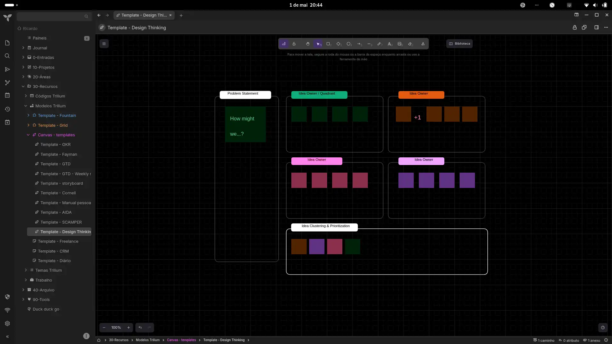
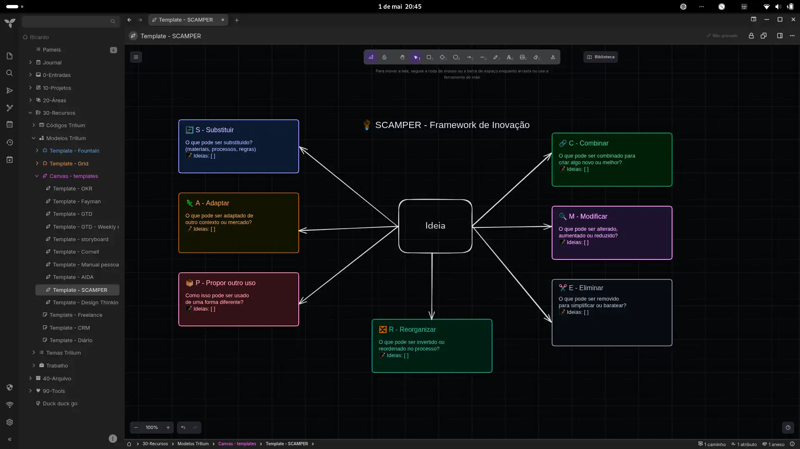
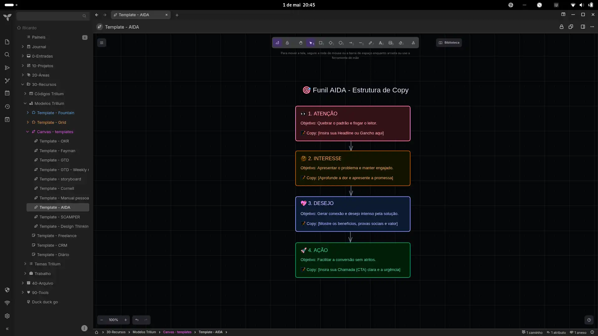
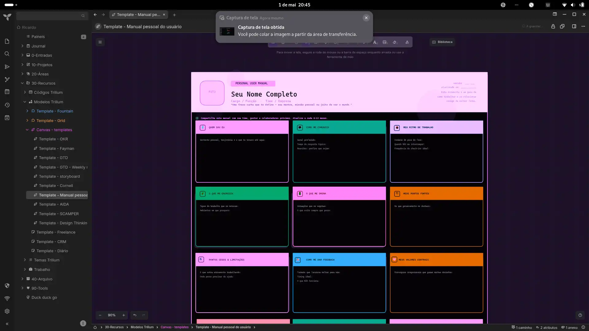
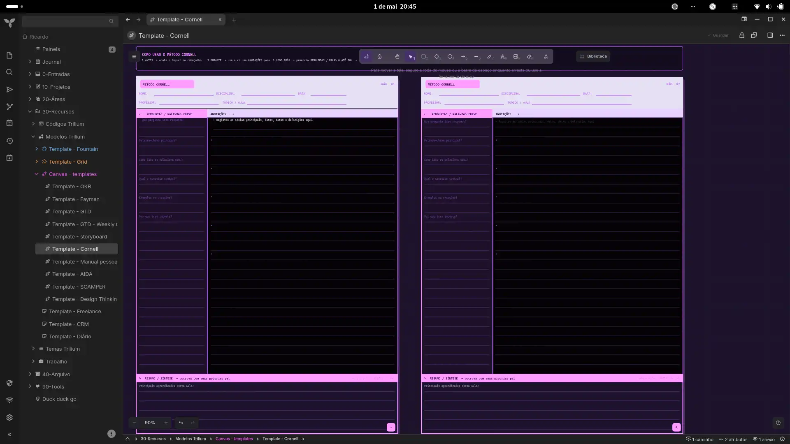
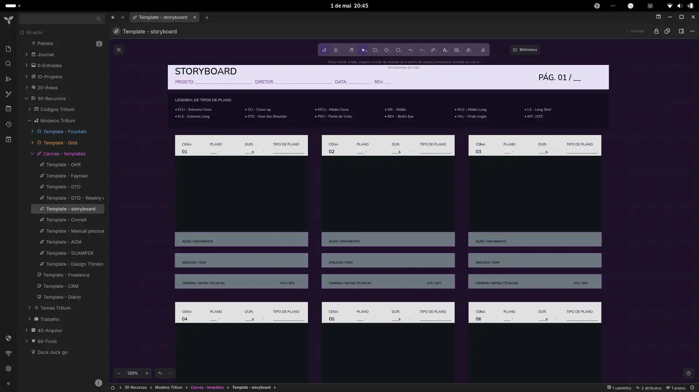
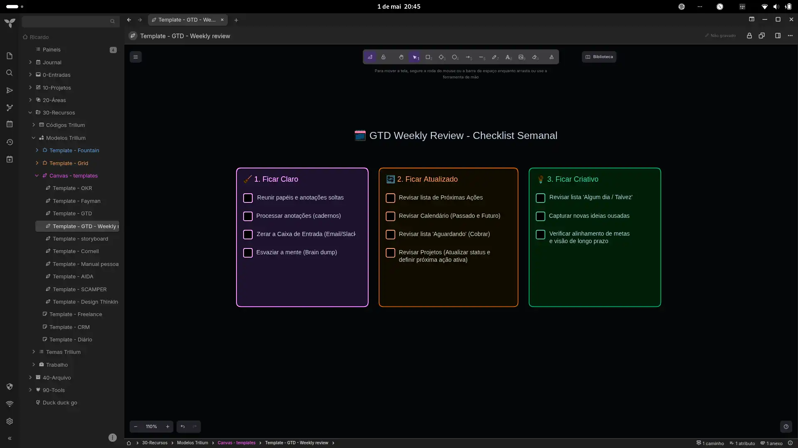
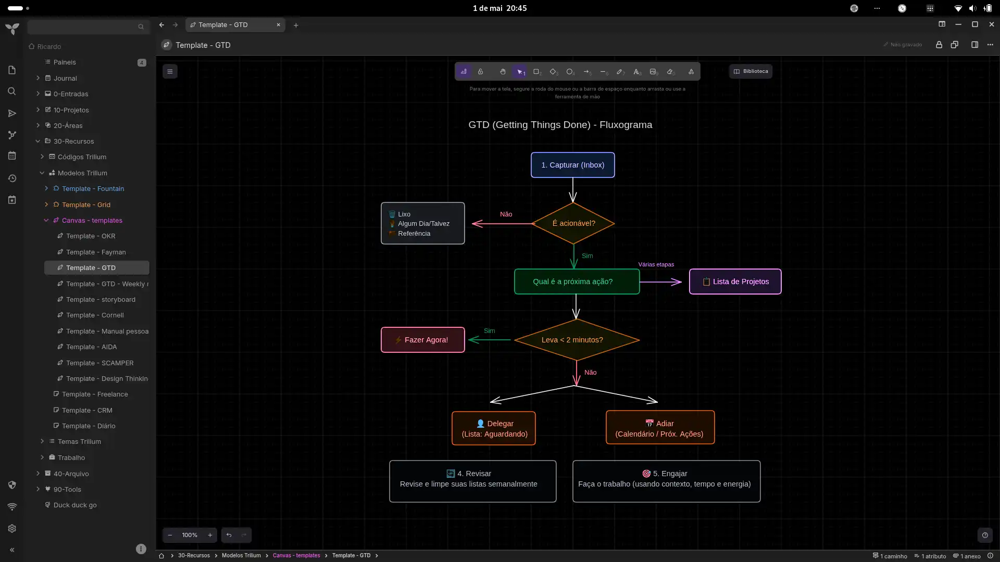
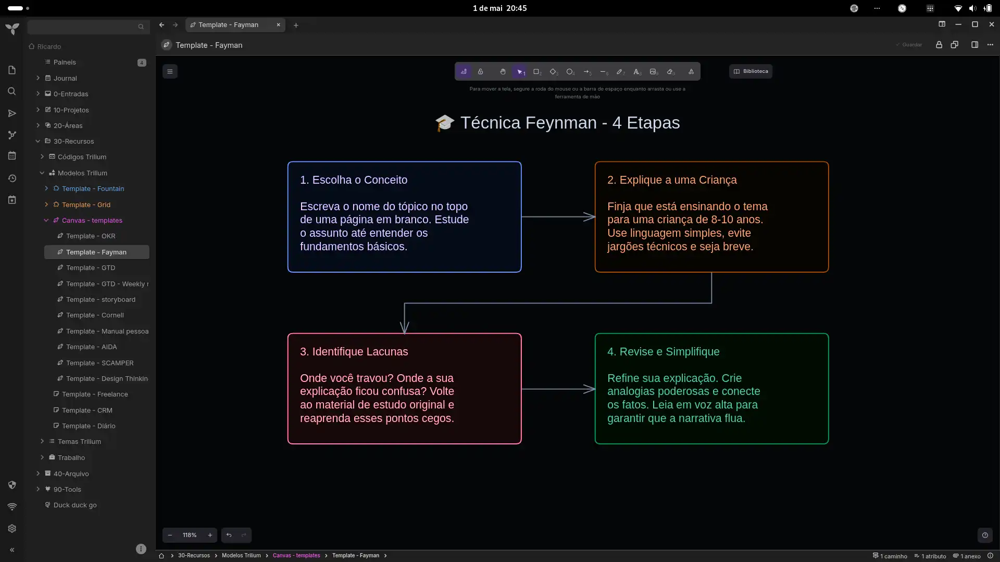
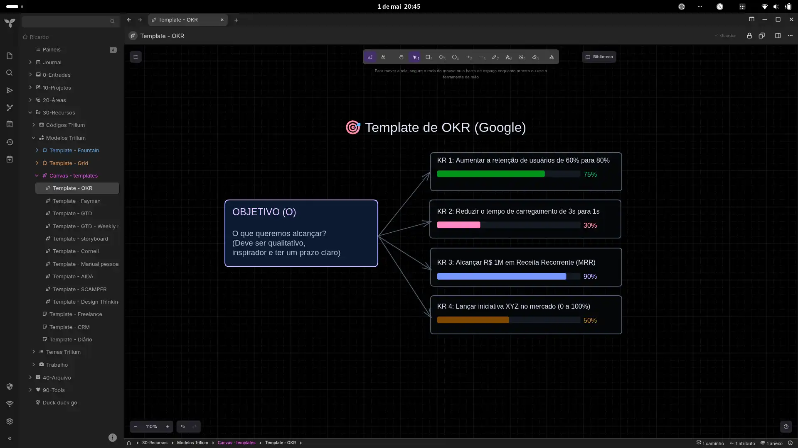
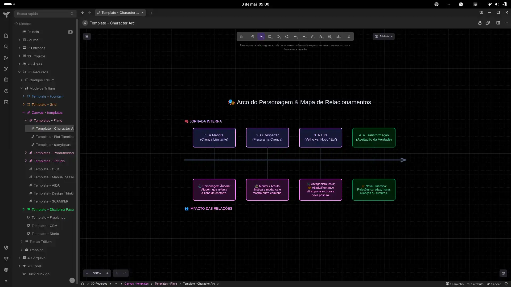
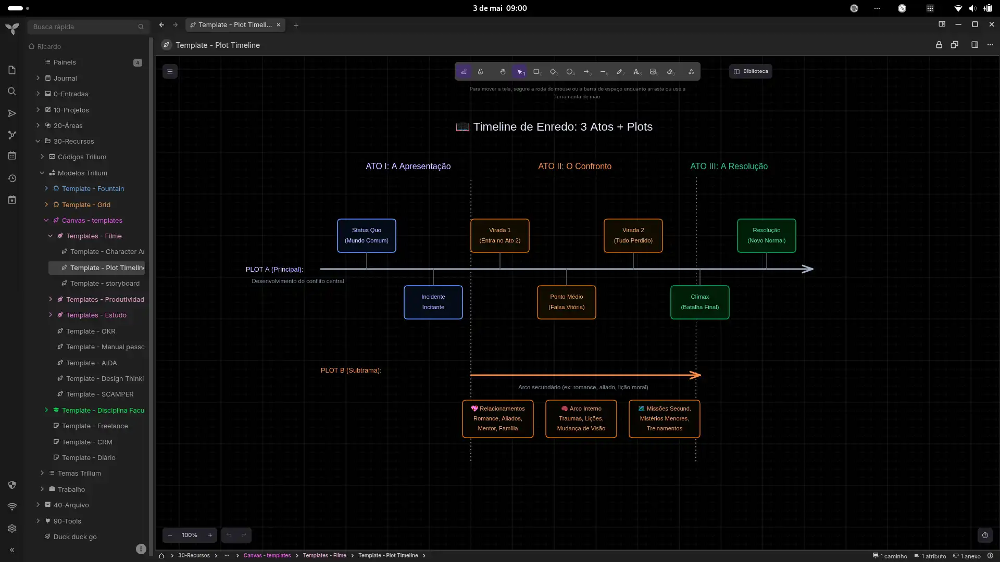
